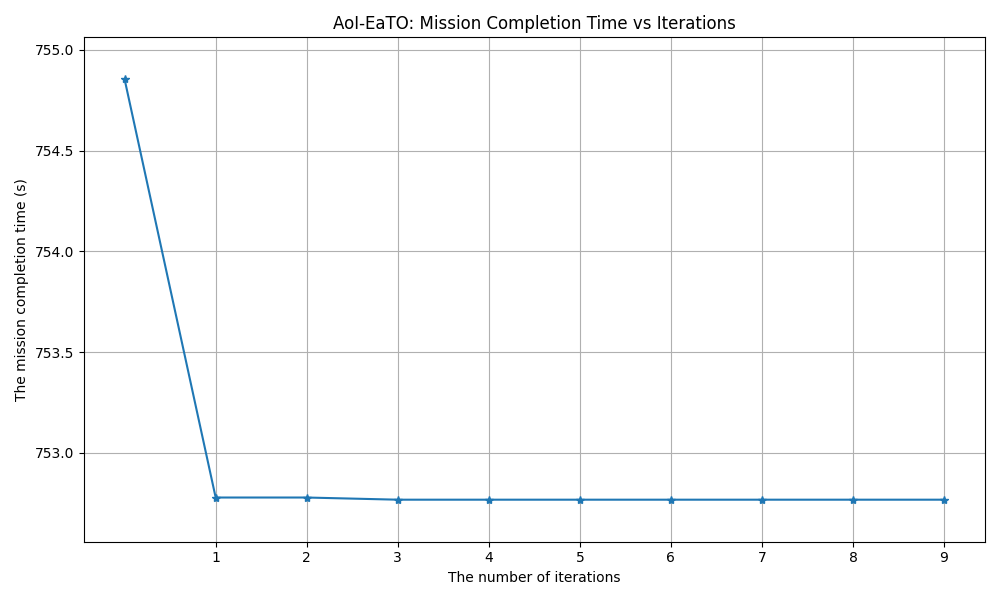

# UAV Trajectory Planning for Data Collection from Time-Constrained IoT Devices

This repository provides the first unofficial implementation of the paper "UAV Trajectory Planning for Data Collection from Time-Constrained IoT Devices" (IEEE Transactions on Wireless Communications 2019). You can find the paper on [IEEE Xplore](https://ieeexplore.ieee.org/document/8842600).

## Overview


This project focuses on optimizing the trajectory of an Unmanned Aerial Vehicle (UAV) for collecting data from time-constrained Internet of Things (IoT) devices. The primary goal is to minimize the overall mission completion time while ensuring that the Age of Information (AoI) for each IoT device remains below a predefined threshold and the UAV's energy consumption stays within its limits.

The core of this implementation is the **AoI-EaTO (Age of Information - Energy and Time Optimized)** algorithm, which iteratively optimizes:
1.  **UAV Speed**: Using Sequential Convex Approximation (SCA).
2.  **Visiting Sequence**: Using a Genetic Algorithm (GA).
3.  **Hovering Positions**: Using Sequential Convex Approximation (SCA) for both data collection and data transmission hovering spots.

The project also includes implementations for baseline comparison algorithms like "Random" sequence and "Greedy" sequence.

## Setup & Getting Started

### Prerequisites
*   Docker (if you want)
*   Python 3.11 (as specified in Dockerfile)

### Dependencies
The main Python dependencies are listed in `requirements.txt`:
*   numpy
*   dacite
*   pyyaml
*   cvxpy
*   matplotlib
*   ecos

### Running with Docker
This is the recommended way to run the simulation.

1.  **Build the Docker image and run the container:**
    ```bash
    docker-compose up --build -d
    ```
2.  **Access the running container:**
    ```bash
    docker exec -it uav_aoi_eto_project /bin/bash
    ```
3.  **Navigate to the workspace and run the simulation:**
    Inside the container's shell:
    ```bash
    cd /workspace
    python main.py --algorithm [ALGORITHM_NAME]
    ```
    Replace `[ALGORITHM_NAME]` with one of the implemented algorithms. Based on `main.py`, possible values are:
    *   `AoI-EaTO`
    *   `Random`
    *   `Greedy`

    For example, to run the AoI-EaTO algorithm:
    ```bash
    python main.py --algorithm AoI-EaTO
    ```
    *(Note: The exact command-line arguments for `main.py` might need verification by checking the `if __name__ == "__main__":` block in `workspace/main.py`. The above is a common way to pass algorithm choices.)*

### Running Locally (Alternative)

1.  **Ensure Python 3.11 is installed.**
2.  **Create a virtual environment (recommended):**
    ```bash
    python3 -m venv venv
    source venv/bin/activate  # On Linux/macOS
    # venv\Scripts\activate    # On Windows
    ```
3.  **Install dependencies:**
    ```bash
    pip install -r requirements.txt
    ```
4.  **Navigate to the workspace directory and run the simulation:**
    ```bash
    cd workspace
    python main.py --algorithm [ALGORITHM_NAME]
    ```
    (Same `main.py` execution notes apply as in the Docker section).

### Run Energy Limitation & AoI Limitation Experiments
1.  **Energy Limitation Experiment**
    ```bash
    cd workspace
    python utils/plot_fig8_9.py
    ```
1.  **AoI Limitation Experiment**
    ```bash
    cd workspace
    python utils/plot_fig13.py
    ```
## Results





The simulation results demonstrate the effectiveness of the AoI-EaTO algorithm in finding an optimized UAV trajectory. Key outcomes include:
*   Optimized visiting sequence for the UAV.
*   Calculated optimal speeds for different segments of the UAV's path.
*   Determined optimal hovering locations for data collection and transmission.
*   Logs detailing mission time, energy consumption, and AoI for the UAV.
*   Visualizations of the UAV trajectory, UAV locations, and communication ranges.

*(This section can be expanded with specific graphs, figures, or key performance indicators from your experiments once available. The `results/` directory is intended for storing such outputs, like trajectory plots.)*